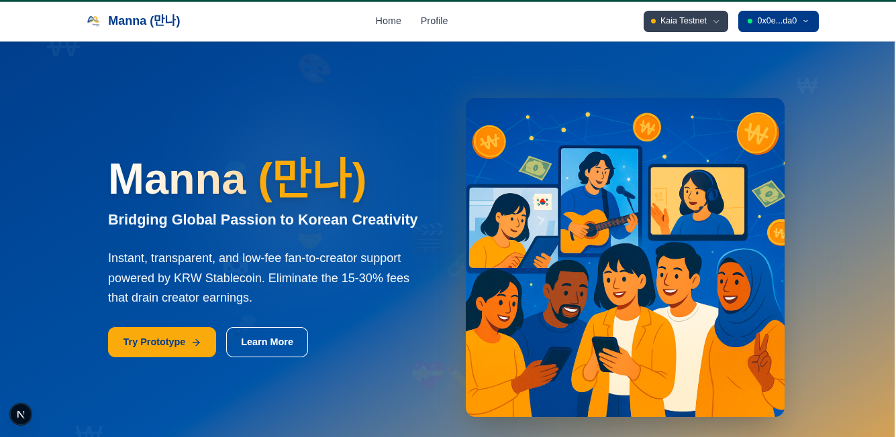
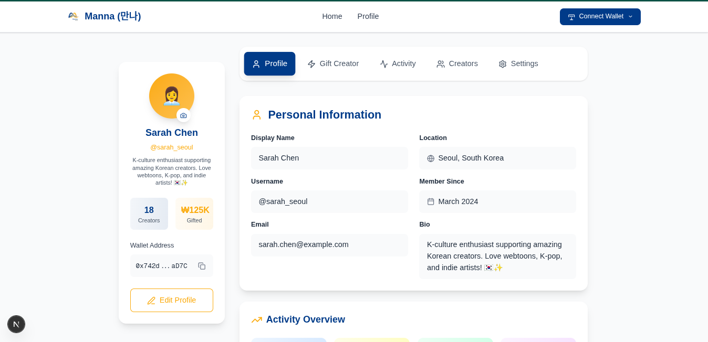

# Manna (만나): Bridging Global Passion to Korean Creativity

**Korea Stablecoin Hackathon 2025 - KRW Stablecoin Ideathon Track**

**Vision:** To build the foundational payment infrastructure for the global K-culture economy, powered by a KRW Stablecoin.

---

## About Manna

Manna (만나) is a decentralized platform designed to revolutionize how global fans support Korean creators (webtoon artists, musicians, streamers, educators). By leveraging a KRW Stablecoin (KRW-S), Manna enables instant, transparent, and low-cost direct financial transfers, solving the pervasive issues of high fees, slow settlements, and lack of transparency in cross-border payments.

This repository contains the proof-of-concept (PoC) for **Phase 1** of our vision, demonstrating the core fan-to-creator tipping functionality. While this prototype is focused, it is the first step in a much larger, multi-phase roadmap.

## Live Prototype & Resources

- **Live Prototype:** [https://mannas.vercel.app/] - *Experience our Phase 1 prototype demonstrating core fan-to-creator support functionality!*
- **Pitch Deck:** [https://docs.google.com/presentation/d/1qKJidCy1NT8JviqDgs9dH36ehSE499nY/edit?usp=sharing&ouid=100528488557506058575&rtpof=true&sd=true] - *Dive deeper into our vision, market, and business model.*
- **Concept Document:** [https://docs.google.com/document/d/1I5fVrMsMLdSgmz3cI8YoEI8o7y8vWkBMGKT31-908u8/edit?usp=sharing] - *Comprehensive details of the project.*

## Application Screenshots

### Landing Page

### User Profile Dashboard

## Our Long-Term Roadmap

Manna's journey unfolds in three strategic phases:

- **Phase 1: Launch Manna (Direct Creator Bridge):** Perfect direct fan-to-creator funding, proving the immediate utility of KRW-S.
- **Phase 2: Build the K-Culture Ecosystem:** Expand into merchandise, digital goods, event ticketing, and gaming integrations.
- **Phase 3: The KRW-S Super-App:** Evolve into a universal payment and loyalty network for the broader Korean economy, including retail and tourism.

## Repository Structure

This repository is organized into two main parts:
- `/frontend/`: Contains the Next.js frontend application with the Phase 1 prototype.
- `/smart-contract/`: Contains the Hardhat project for the KRW-S stablecoin smart contract.

For detailed instructions on running the frontend prototype, please refer to the [Frontend README](./frontend/README.md).
For details on the KRW Stablecoin smart contract, please refer to the [Smart Contract README](./smart-contract/README.md).

## Tech Stack (Phase 1 Prototype)

- **Blockchain:** Kaia Testnet (Baobab)
- **Frontend:** Next.js (TypeScript, Tailwind CSS)
- **Web3 Library:** Wagmi
- **Wallet Integration:** Kaikas / MetaMask
- **Smart Contract:** ERC-20 KRW-S Stablecoin

##  Curated By 
Babalola Taiwo J
t.babalolajoseph@gmail.com

